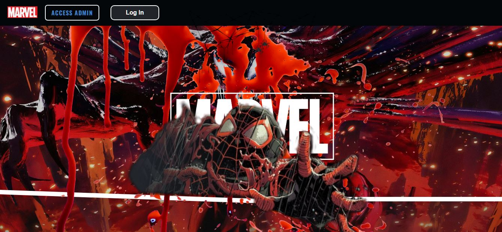
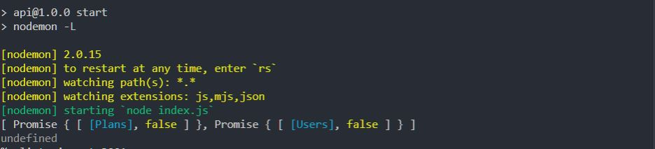
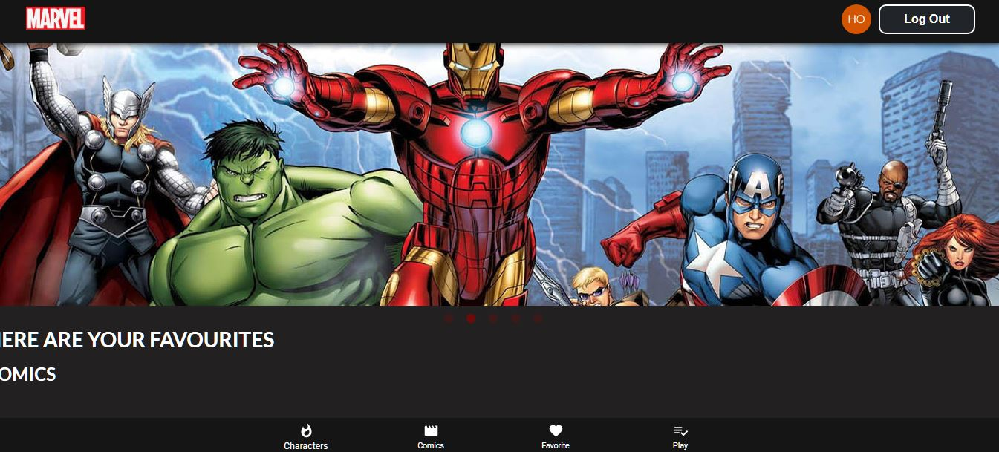
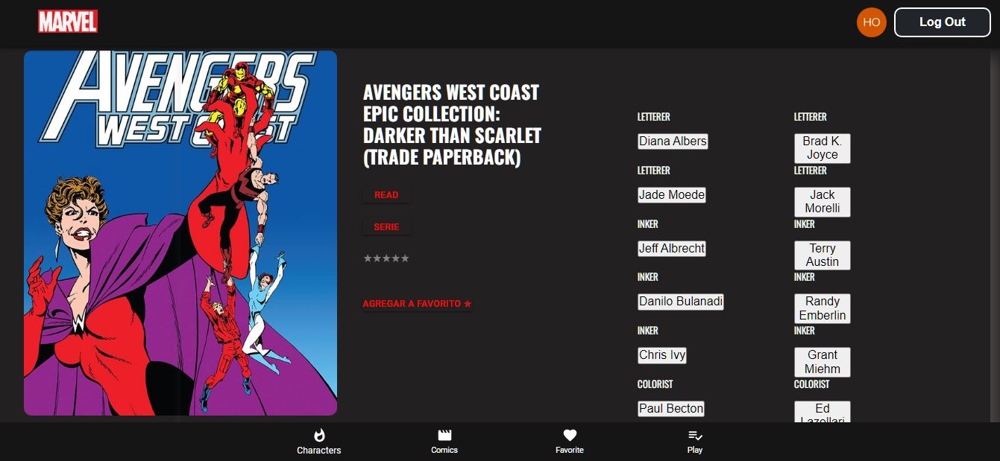

# MARVEL+

This app was the final project to been graduated as Full Stack Developer. 
This app consumes the [API Marvel Comics](https://developer.marvel.com/) and would allow to  get,by a regular payment , access to lecture to Marvel comics. For those who aren't paying yet would be able to navigate the whole catalog of comics and characters. There are some filters and search bars to offer a better UX. For the owner, there is a private module where it is possible to add and remove comics, upgrade users and get stats about billing and other key points for business. The design and components were made to be affordable and adaptatives.


## What more I ´d like to let you know about this project?

This was a great experience where I had the opportunity to work in a team which had to be coordinated to take to term a huge project in less than three weeks.
I´m glad for the support and for hearing when I proposed to them to do something quite different as a final project.
We lost some colleagues on this journey, but that made us even more effective and gave us the chance to take the best of each one.
</br>
At tech level, I've definitely connected what I 've learned so far about React JS and its lifecycles, and successfully implemented its latest features, such as hooks , React router v6, among others.
Although my participation was stronger in frontend, I was also actively involved in the backend. At firs, defining the necessary routes to connect components and then in a more global way I've collaborated in the creation of models to improve database-
I learned about login libraries, and choosed to implement Auh0 . I also took care of protected routes to allow access according to the user role.
Finally, this project gave me the chance to investigate several libraries-some of them barely heard of me- some were implemented, others have already become available tools for future work
</br>


## Getting Started

These instructions will get you a copy of the project up and running on your local machine for development and testing purposes.
<br/>
-Clone this repo.

### Prerequisites
- Database is requiered for some services, like login, and allow you to save information too.
- Then run *npm install* to get dependencies

```
Be sure to have installed PostgreSQL and create a database called marvel
```

### Installing

When dependencies are installed, you are almost done! 
Just run npm start at 📂 backend and 📂 frontend directories.
The project will run by default at port 3000 and you  run on your browser and backend should be listening at 3001.

```
The project will run by default at port 3000 and you may watch it running on your browser
```
<p align="left">
  
</p>

```
backend should be listening at 3001.
```

<p align="left">
  
</p>

<!--- faltan los test por aquí --->

## Built With

* React-Redux-JS
* Node Js- Sequelize - Postgress
* Some amazing styles and icons libraries as [Semantic](https://semantic-ui.com/) UI and [Material UI](https://v4.mui.com/)


## Authors

* **[Luciana Chamorro](https://github.com/LucianaCHA)**
* **[Melisa Ferreyra](https://github.com/MelisaF)**
* **[Milagros Barrantes](https://github.com/milagrosDiezBarrantes)**
* **[Joel Perez ](https://github.com/Fenrir0990)**
* **[Alexis Mendez](https://github.com/Alexis-Mendez281)**


## :pushpin: Previews :pushpin:

<div >
  <p align="left"><h5 align="left">Landing Page</h3>
  

  <h5 align="left">Favorite section and amazing carrousel</h3>
  

 <h5 align="left">Home comics</h3>
  

<h5 align="left">Detail view</h3>
  


</p>
    </div>

